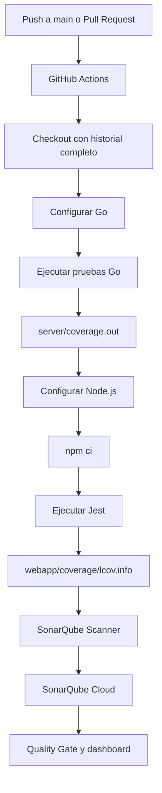

# Integración de SonarQube Cloud con GitHub Actions en Focalboard

## Resumen

Este documento describe la integración completa de **SonarQube Cloud** con el pipeline CI/CD del repositorio público [`LEPISMAS/focalboard`](https://github.com/LEPISMAS/focalboard). La integración analiza el backend Go y el frontend TypeScript/React, ejecuta las pruebas automáticas, genera reportes de cobertura y publica los resultados en SonarQube Cloud después de cada push a `main` y en cada Pull Request.

La implementación quedó operativa el **18 de julio de 2026**. El workflow de GitHub Actions finaliza correctamente y SonarQube recibe cobertura real de Go y Jest. El Quality Gate todavía está en rojo por la calificación de seguridad del código nuevo; esta condición pendiente se documenta en la sección [Estado actual](#estado-actual).

## Tabla de contenido

1. [Objetivos](#objetivos)
2. [Qué es SonarQube](#qué-es-sonarqube)
3. [Arquitectura de la integración](#arquitectura-de-la-integración)
4. [Requisitos previos](#requisitos-previos)
5. [Creación de la organización y proyecto](#creación-de-la-organización-y-proyecto)
6. [Configuración segura del token](#configuración-segura-del-token)
7. [Cambio a análisis mediante CI](#cambio-a-análisis-mediante-ci)
8. [Configuración del proyecto](#configuración-del-proyecto)
9. [Workflow de GitHub Actions](#workflow-de-github-actions)
10. [Generación e importación de cobertura](#generación-e-importación-de-cobertura)
11. [Incidencia encontrada en TestPatchBoard](#incidencia-encontrada-en-testpatchboard)
12. [Quality Gate](#quality-gate)
13. [Estado actual](#estado-actual)
14. [Interpretación de métricas](#interpretación-de-métricas)
15. [Ejecución y verificación](#ejecución-y-verificación)
16. [Solución de problemas](#solución-de-problemas)
17. [Seguridad y mantenimiento](#seguridad-y-mantenimiento)
18. [Trabajo pendiente](#trabajo-pendiente)
19. [Conclusiones](#conclusiones)

## Objetivos

La integración se implementó con los siguientes objetivos:

- automatizar el análisis estático del backend Go y del frontend TypeScript/React;
- detectar bugs, vulnerabilidades, problemas de mantenibilidad y duplicación;
- importar cobertura real generada por `go test` y Jest;
- ejecutar el análisis con GitHub Actions en cada cambio relevante;
- mostrar un Quality Gate verificable en SonarQube Cloud;
- mantener el token de análisis fuera del repositorio;
- generar evidencia reproducible para la presentación final del proyecto;
- preparar el pipeline para exigir al menos 85% de cobertura en código nuevo.

## Qué es SonarQube

SonarQube es una plataforma de inspección continua de calidad y seguridad de software. Analiza el código sin ejecutarlo y clasifica sus hallazgos en categorías como:

- **Security:** vulnerabilidades y prácticas potencialmente inseguras;
- **Reliability:** posibles bugs o comportamientos incorrectos;
- **Maintainability:** deuda técnica y code smells;
- **Security Hotspots:** fragmentos sensibles que requieren revisión humana;
- **Coverage:** porcentaje de código ejercitado por las pruebas;
- **Duplications:** porcentaje de líneas duplicadas.

SonarQube **no reemplaza** las pruebas unitarias, funcionales, de integración o E2E. Tampoco genera cobertura por sí mismo. Las herramientas de prueba producen los reportes y SonarQube los importa, relacionándolos con el código analizado.

Para Focalboard se eligió **SonarQube Cloud** porque no requiere administrar un servidor, base de datos, actualizaciones o infraestructura propia. El repositorio es público, por lo que puede utilizarse el plan para proyectos públicos/OSS. Durante la configuración se activó un periodo de prueba del plan Team; se debe revisar la suscripción antes de su vencimiento y conservar una modalidad gratuita adecuada para el repositorio público.

## Arquitectura de la integración



El análisis recorre estas capas:

| Capa | Tecnología | Responsabilidad |
|---|---|---|
| Repositorio | GitHub | Código fuente, historial y Pull Requests |
| CI/CD | GitHub Actions | Ejecución automática del pipeline |
| Backend | Go 1.21 | Pruebas y reporte `coverage.out` |
| Frontend | Node.js 20.11, TypeScript, React y Jest | Pruebas y reporte LCOV |
| Análisis | SonarQube Scanner | Indexación, análisis e importación de reportes |
| Plataforma | SonarQube Cloud | Dashboard, issues y Quality Gate |

## Requisitos previos

Para reproducir la configuración se necesita:

- una cuenta de GitHub con acceso administrativo a `LEPISMAS/focalboard`;
- permiso para instalar la aplicación de SonarQube Cloud en la organización `LEPISMAS`;
- permiso para administrar Secrets y workflows de GitHub Actions;
- una cuenta de SonarQube Cloud;
- el repositorio visible para la aplicación de SonarQube;
- la rama principal `main`;
- pruebas Go y Jest ejecutables en Ubuntu.

## Creación de la organización y proyecto

### 1. Autenticación

Se ingresó a [SonarQube Cloud](https://sonarcloud.io/) usando GitHub como proveedor de identidad.

### 2. Instalación de la aplicación

La aplicación de SonarQube Cloud se instaló en la organización `LEPISMAS`. Como práctica de mínimo privilegio, se concedió acceso únicamente al repositorio:

```text
LEPISMAS/focalboard
```

No es necesario autorizar todos los repositorios de la organización.

### 3. Organización de SonarQube

Se creó/importó la organización:

```text
Organization: lepismas
```

Dashboard de proyectos:

```text
https://sonarcloud.io/organizations/lepismas/projects
```

### 4. Importación del proyecto

Se importó `LEPISMAS/focalboard` como proyecto público. SonarQube asignó estos identificadores:

```text
Project key: LEPISMAS_focalboard
Organization: lepismas
Project name: focalboard
Default branch: main
```

El primer análisis automático indexó aproximadamente 169,000 líneas porque tomó un alcance amplio del repositorio. Posteriormente, el análisis por CI limitó el código productivo a `server` y `webapp/src`.

## Configuración segura del token

SonarQube necesita un token para aceptar análisis enviados desde GitHub Actions.

### Creación y rotación

Durante la configuración inicial, un token apareció fuera del almacén de secretos. Se consideró comprometido, fue revocado inmediatamente y se generó uno nuevo. Nunca se reutilizó el valor expuesto.

Esta respuesta aplica una regla importante:

> Todo token mostrado en texto, chat, captura, log o commit debe considerarse comprometido y revocarse.

### Almacenamiento en GitHub

El token nuevo se guardó en:

```text
GitHub repository
  -> Settings
  -> Secrets and variables
  -> Actions
  -> Repository secrets
  -> SONAR_TOKEN
```

Configuración:

```text
Name: SONAR_TOKEN
Value: [TOKEN SECRETO; NO DOCUMENTAR]
```

El workflow consume el secreto con:

```yaml
env:
  SONAR_TOKEN: ${{ secrets.SONAR_TOKEN }}
```

El token no debe almacenarse en:

- `sonar-project.properties`;
- archivos `.env` versionados;
- código fuente;
- comentarios de issues;
- documentación;
- logs o capturas;
- variables públicas de GitHub Actions.

## Cambio a análisis mediante CI

SonarQube inició con **Automatic Analysis**. Este modo permitió obtener un diagnóstico inicial, pero tiene una limitación decisiva: no importa reportes de cobertura de Go o Jest.

También existe una incompatibilidad operativa: Automatic Analysis y CI-based Analysis no deben ejecutarse simultáneamente para el mismo proyecto, porque generan análisis duplicados o fallos.

Se desactivó Automatic Analysis desde:

```text
Project
  -> Administration
  -> Analysis Method
  -> Automatic Analysis
  -> Disabled for this project
```

Después se seleccionó:

```text
Set up analysis via other methods
  -> With GitHub Actions
  -> Other (for Go, PHP, ...)
  -> Linux
```

Se eligió `Other` porque Focalboard combina Go y TypeScript y necesita una configuración manual de reportes.

## Configuración del proyecto

Se creó [`sonar-project.properties`](../../../sonar-project.properties) en la raíz del repositorio.

Contenido actual:

```properties
sonar.projectKey=LEPISMAS_focalboard
sonar.organization=lepismas
sonar.projectName=focalboard
sonar.sourceEncoding=UTF-8

# Production code analyzed by SonarQube Cloud.
sonar.sources=server,webapp/src

# Test code is classified separately from production code.
sonar.tests=server,webapp/src,webapp/cypress
sonar.test.inclusions=server/**/*_test.go,webapp/src/**/*.test.ts,webapp/src/**/*.test.tsx,webapp/cypress/**/*.ts

# Avoid indexing tests twice and ignore generated/build artifacts.
sonar.exclusions=server/**/*_test.go,webapp/src/**/*.test.ts,webapp/src/**/*.test.tsx,server/**/*mock*.go,server/swagger/**,webapp/pack/**,webapp/coverage/**

# Coverage reports generated in GitHub Actions before the scan.
sonar.go.coverage.reportPaths=server/coverage.out
sonar.javascript.lcov.reportPaths=webapp/coverage/lcov.info
```

### Explicación de propiedades

| Propiedad | Función |
|---|---|
| `sonar.projectKey` | Identificador único del proyecto en SonarQube Cloud |
| `sonar.organization` | Organización propietaria del proyecto |
| `sonar.sources` | Directorios considerados código productivo |
| `sonar.tests` | Directorios donde pueden existir pruebas |
| `sonar.test.inclusions` | Patrones que clasifican archivos como pruebas |
| `sonar.exclusions` | Archivos que no deben indexarse como producción |
| `sonar.go.coverage.reportPaths` | Reporte de cobertura estándar de Go |
| `sonar.javascript.lcov.reportPaths` | Reporte LCOV producido por Jest |
| `sonar.sourceEncoding` | Codificación usada al leer el código |

### Alcance

El análisis actual incluye:

- backend ubicado en `server`;
- frontend ubicado en `webapp/src`;
- pruebas Go `*_test.go`;
- pruebas Jest `*.test.ts` y `*.test.tsx`;
- specs Cypress como código de prueba.

Se excluyen del código productivo:

- pruebas para evitar indexación doble;
- mocks generados;
- documentación Swagger generada;
- bundle compilado `webapp/pack`;
- reportes temporales de cobertura.

## Workflow de GitHub Actions

Se creó [`.github/workflows/sonarqube.yml`](../../../.github/workflows/sonarqube.yml).

Contenido actual:

```yaml
name: SonarQube

on:
  push:
    branches:
      - main
  pull_request:
    types: [opened, synchronize, reopened]

permissions:
  contents: read

jobs:
  sonarqube:
    name: SonarQube Cloud
    runs-on: ubuntu-22.04
    steps:
      - name: Checkout
        uses: actions/checkout@34e114876b0b11c390a56381ad16ebd13914f8d5
        with:
          fetch-depth: 0

      - name: Set up Go
        uses: actions/setup-go@d35c59abb061a4a6fb18e82ac0862c26744d6ab5
        with:
          go-version-file: server/go.mod
          cache-dependency-path: server/go.sum

      - name: Generate Go coverage
        working-directory: server
        env:
          FOCALBOARD_UNIT_TESTING: "1"
        run: go test -tags "json1 sqlite3" -coverpkg=./... -coverprofile=coverage.out -count=1 -timeout=30m ./...

      - name: Set up Node.js
        uses: actions/setup-node@49933ea5288caeca8642d1e84afbd3f7d6820020
        with:
          node-version-file: webapp/.nvmrc
          cache: npm
          cache-dependency-path: webapp/package-lock.json

      - name: Install Webapp dependencies
        working-directory: webapp
        run: npm ci

      - name: Generate Webapp coverage
        working-directory: webapp
        run: npm test -- --coverage --runInBand

      - name: SonarQube scan
        uses: SonarSource/sonarqube-scan-action@7006c4492b2e0ee0f816d36501671557c97f5995
        env:
          SONAR_TOKEN: ${{ secrets.SONAR_TOKEN }}
```

### Decisiones del workflow

- Se utiliza Ubuntu 22.04 para coincidir con los jobs Linux existentes.
- Las actions están fijadas por SHA para reducir riesgos de supply chain.
- `fetch-depth: 0` entrega el historial completo para calcular código nuevo y asignar autoría correctamente.
- `permissions: contents: read` aplica mínimo privilegio.
- Las cachés de Go y npm reducen tiempo en ejecuciones posteriores.
- El scanner se ejecuta después de las pruebas; no se publican reportes incompletos cuando una suite falla.
- No se usa `continue-on-error` ni `|| true`, porque ocultar una prueba fallida produciría métricas engañosas.

## Generación e importación de cobertura

### Cobertura Go

GitHub Actions ejecuta:

```bash
cd server
FOCALBOARD_UNIT_TESTING=1 go test \
  -tags "json1 sqlite3" \
  -coverpkg=./... \
  -coverprofile=coverage.out \
  -count=1 \
  -timeout=30m \
  ./...
```

Significado de los parámetros:

| Parámetro | Propósito |
|---|---|
| `FOCALBOARD_UNIT_TESTING=1` | Activa comportamiento de pruebas del servidor |
| `-tags "json1 sqlite3"` | Incluye soporte SQLite/JSON requerido por Focalboard |
| `-coverpkg=./...` | Mide todos los paquetes del módulo |
| `-coverprofile=coverage.out` | Escribe el reporte que importa SonarQube |
| `-count=1` | Evita resultados provenientes de caché de tests |
| `-timeout=30m` | Define un límite para la suite completa |

El archivo queda en:

```text
server/coverage.out
```

SonarQube lo importa mediante:

```properties
sonar.go.coverage.reportPaths=server/coverage.out
```

### Cobertura TypeScript/React

GitHub Actions ejecuta:

```bash
cd webapp
npm ci
npm test -- --coverage --runInBand
```

`npm ci` instala exactamente las versiones bloqueadas en `package-lock.json`. Jest ejecuta las pruebas secuencialmente y produce un reporte LCOV:

```text
webapp/coverage/lcov.info
```

SonarQube lo importa mediante:

```properties
sonar.javascript.lcov.reportPaths=webapp/coverage/lcov.info
```

### Por qué inicialmente aparecía 0%

El primer análisis por CI solo ejecutaba el scanner. Como no existían `server/coverage.out` ni `webapp/coverage/lcov.info`, SonarQube mostraba cobertura global de 0.0%.

Agregar rutas en `sonar-project.properties` no es suficiente: los archivos deben generarse antes del scanner y permanecer en el mismo workspace del runner.

## Incidencia encontrada en TestPatchBoard

Al incorporar cobertura Go, el pipeline se detuvo en:

```text
TestPatchBoard/patch_type_remove_channel,_user_without_post_permissions
```

Los síntomas incluían:

```text
Unexpected call to MockStore.PatchBoard
missing call(s) to HasPermissionToTeam
missing call(s) to HasPermissionToChannel
missing call(s) to GetMembersForBoard
```

### Causa raíz

Los diez subtests de `TestPatchBoard` compartían un solo `TestHelper`, un controlador de mocks y una cola asíncrona de notificaciones. `PatchBoard` encola broadcasts WebSocket; algunas llamadas terminaban cuando el siguiente subtest ya había comenzado. Como los mocks también se compartían, una expectativa podía:

- ser consumida por otro subtest;
- llegar a su máximo antes del caso correcto;
- coincidir con una expectativa de permisos perteneciente a otro escenario;
- dejar llamadas pendientes al finalizar el test padre.

El fallo era no determinista y también explicaba errores observados en MariaDB.

### Corrección

Se modificó [`server/app/boards_test.go`](../../../server/app/boards_test.go) para que cada subtest cree y cierre su propio entorno:

```go
t.Run("nombre del escenario", func(t *testing.T) {
    th, tearDown := SetupTestHelper(t)
    defer tearDown()

    // expectativas y ejecución exclusivas del escenario
})
```

Después del aislamiento se corrigieron cuatro expectativas que antes eran satisfechas accidentalmente por otros casos:

- se eliminó un `GetUserByID` que no pertenecía al caso sin usuarios;
- se ajustó a dos el número real de llamadas a `GetBoard` para tablero abierto con miembro;
- se ajustó a dos el número real de llamadas a `GetBoard` para tablero privado con miembro;
- se agregó `GetUserByID` al escenario de vínculo con canal, necesario para publicar el mensaje.

No se cambió la lógica productiva de `PatchBoard` y no se ignoró el fallo.

### Validación focalizada en Docker

La corrección se validó desde PowerShell con:

```powershell
docker run --rm -v "${PWD}:/work" -w /work/server golang:1.21-bullseye bash -c "FOCALBOARD_UNIT_TESTING=1 go test -tags 'json1 sqlite3' -count=1 ./app -run TestPatchBoard"
```

Resultado:

```text
ok github.com/mattermost/focalboard/server/app
```

Después del commit, el workflow completo generó cobertura y publicó las métricas correctamente.

## Quality Gate

El proyecto utiliza actualmente el Quality Gate integrado **Sonar way**. Evalúa código nuevo con estas condiciones:

| Condición en código nuevo | Umbral |
|---|---:|
| Reliability Rating | A |
| Security Rating | A |
| Maintainability Rating | A |
| Security Hotspots Reviewed | 100% |
| Coverage | ≥80% |
| Duplicated Lines | ≤3% |

Para el requisito académico se planea crear un Quality Gate propio con cobertura de código nuevo **≥85%**. No se recomienda exigir de inmediato 85% sobre todo el código histórico, porque la cobertura global actual es menor y eso bloquearía el pipeline sin distinguir la deuda heredada de los cambios del equipo.

### Diferencia entre Overall Code y New Code

- **Overall Code:** todo el código incluido en el análisis, incluida deuda histórica.
- **New Code:** líneas agregadas o modificadas durante el periodo de código nuevo.

La estrategia recomendada es mantener controles estrictos sobre New Code y mejorar Overall Code de manera incremental.

## Estado actual

Métricas consultadas mediante la API pública de SonarQube Cloud el **18 de julio de 2026**:

| Métrica | Valor actual | Interpretación |
|---|---:|---|
| Quality Gate | Failed | Existe una condición de código nuevo incumplida |
| Lines of Code (NCLOC) | 101,806 | Líneas no comentadas reconocidas por SonarQube |
| Coverage global | 71.4% | Go y Jest se importan correctamente, pero el total todavía no alcanza 85% |
| Duplicated Lines | 9.3% | Deuda histórica superior al objetivo de 3% para código nuevo |
| Security Rating global | D | Existen vulnerabilidades históricas abiertas |
| Reliability Rating global | E | Existen bugs históricos de alta severidad |
| Maintainability Rating global | A | La relación de deuda técnica es aceptable |
| Vulnerabilities | 15 | Hallazgos de seguridad abiertos según la métrica clásica |
| Bugs | 90 | Bugs según la métrica clásica de SonarQube |
| Code Smells | 1,011 | Hallazgos de mantenibilidad |

Las cifras de la interfaz pueden diferir de las métricas clásicas `bugs`, `vulnerabilities` y `code_smells` porque SonarQube también muestra un modelo nuevo de Software Quality. La fecha y el alcance deben acompañar cualquier captura usada en la presentación.

### Condición exacta que falla

El endpoint público de Quality Gate informa:

| Condición de código nuevo | Resultado | Valor |
|---|---|---:|
| Reliability Rating | Passed | A |
| Security Rating | **Failed** | C |
| Maintainability Rating | Passed | A |
| Duplicated Lines | Passed | 0.0% |
| Security Hotspots Reviewed | Passed | 100% |

La condición pendiente es, por tanto, **Security Rating del código nuevo = C**, cuando el Quality Gate exige A.

La condición de cobertura de código nuevo no aparece en el último cálculo porque SonarQube ignora cobertura y duplicación cuando el cambio tiene menos de 20 líneas, evitando falsos fallos en cambios demasiado pequeños. Esto no altera la cobertura global de 71.4%.

## Interpretación de métricas

### Coverage 71.4%

Confirma que los dos reportes fueron encontrados y combinados. No significa que todos los módulos tengan 71.4%; es una agregación sobre las líneas ejecutables incluidas en el alcance.

Para presentar cobertura ≥85% se debe especificar claramente una de estas alternativas:

1. cobertura de **código nuevo** ≥85%, aplicada mediante Quality Gate; o
2. cobertura de módulos seleccionados ≥85%, acompañada por reportes por componente; o
3. cobertura global ≥85%, que todavía no se cumple.

No debe afirmarse que el repositorio completo tiene 85% mientras el dashboard global indique 71.4%.

### Duplicación 9.3%

Es deuda histórica del alcance completo. El último código nuevo reporta 0.0%, por lo que la condición de ≤3% pasa.

### Security D y Reliability E

Las calificaciones globales reflejan el repositorio heredado. El Quality Gate se concentra en código nuevo para impedir que la deuda aumente. Los hallazgos deben priorizarse por severidad, impacto, posibilidad de explotación y relación con cambios del equipo.

### Maintainability A

Aunque existen más de mil code smells, la calificación A indica que la relación entre deuda técnica estimada y costo de desarrollo permanece dentro del rango aceptado por SonarQube.

## Ejecución y verificación

### Ejecución automática

No se necesita ejecutar manualmente SonarScanner. El workflow se activa con:

- push a `main`;
- apertura de Pull Request;
- actualización (`synchronize`) de Pull Request;
- reapertura de Pull Request.

### Verificación en GitHub

1. Abrir el repositorio en GitHub.
2. Ir a **Actions**.
3. Seleccionar **SonarQube**.
4. Abrir el job **SonarQube Cloud**.
5. Confirmar en orden:
   - `Checkout`;
   - `Set up Go`;
   - `Generate Go coverage`;
   - `Set up Node.js`;
   - `Install Webapp dependencies`;
   - `Generate Webapp coverage`;
   - `SonarQube scan`.

### Verificación en SonarQube Cloud

1. Abrir `https://sonarcloud.io/organizations/lepismas/projects`.
2. Seleccionar `focalboard`.
3. Confirmar que **Last analysis** corresponde al último commit.
4. Revisar **Coverage**, **Duplications**, **Security**, **Reliability** y **Maintainability**.
5. Abrir el detalle de **Quality Gate** para identificar condiciones fallidas.

### API pública de métricas

Las métricas pueden consultarse sin copiar datos manualmente:

```text
https://sonarcloud.io/api/measures/component?component=LEPISMAS_focalboard&metricKeys=alert_status,coverage,duplicated_lines_density,ncloc,security_rating,reliability_rating,sqale_rating,bugs,vulnerabilities,code_smells
```

Estado del Quality Gate:

```text
https://sonarcloud.io/api/qualitygates/project_status?projectKey=LEPISMAS_focalboard
```

## Solución de problemas

### Coverage aparece en 0.0%

Comprobar:

- que las pruebas se ejecutan antes del scanner;
- que existe `server/coverage.out`;
- que existe `webapp/coverage/lcov.info`;
- que las rutas en `sonar-project.properties` son relativas a la raíz;
- que el scanner trabaja en el mismo workspace;
- que Jest se ejecuta con `--coverage`.

### Automatic Analysis entra en conflicto

Síntomas:

- análisis duplicados;
- rechazo del análisis enviado por CI;
- propiedades ignoradas;
- cobertura ausente.

Solución: desactivar Automatic Analysis en `Administration -> Analysis Method` y conservar solo GitHub Actions.

### SONAR_TOKEN ausente o inválido

Síntomas frecuentes:

```text
Not authorized
You're not authorized to analyze this project
Project not found
```

Comprobar:

- que el secret se llama exactamente `SONAR_TOKEN`;
- que está en **Repository secrets**, no en Variables;
- que el token no fue revocado;
- que corresponde al proyecto/organización correctos;
- que el workflow referencia `${{ secrets.SONAR_TOKEN }}`.

Nunca imprimir el secreto para depurar. Si existe duda, rotarlo.

### Las pruebas Go bloquean el scanner

Este comportamiento es intencional. Una prueba fallida invalida el reporte y debe corregirse. No usar:

```bash
go test ./... || true
```

ni:

```yaml
continue-on-error: true
```

El incidente de `TestPatchBoard` demuestra que integrar cobertura también ayuda a descubrir pruebas inestables.

### Advertencia de Node 20 en GitHub Actions

GitHub puede informar que el runtime Node 20 usado internamente por algunas actions está deprecado y ejecutarlas con Node 24. Esta advertencia pertenece a la versión de la action, no al comando Jest de Focalboard. Las actions deben actualizarse a SHAs compatibles cuando el proyecto lo planifique; no debe habilitarse una versión insegura únicamente para ocultar la advertencia.

### Hallazgo por uso de npx

SonarQube señaló scripts como:

```text
webapp/src/pages/tests/run_tests_pages.sh
webapp/src/store/tests/run_tests_redux.sh
```

porque `npx` puede instalar paquetes bajo demanda. Una mitigación habitual es exigir dependencias ya instaladas:

```bash
npx --no-install jest
```

Antes de aplicar el cambio debe confirmarse que Jest está disponible en `node_modules/.bin` y validar los scripts afectados.

### El Quality Gate falla aunque el workflow sea verde

El scanner puede terminar correctamente y SonarQube marcar el Quality Gate como `Failed`. Son dos resultados diferentes:

- **workflow verde:** el análisis fue ejecutado y enviado correctamente;
- **Quality Gate rojo:** las métricas no cumplen alguna política.

Para bloquear el pipeline por Quality Gate se debe configurar espera del resultado o convertir el check de SonarQube en requisito de protección de rama.

## Seguridad y mantenimiento

### Rotación de token

Rotar `SONAR_TOKEN` cuando:

- se exponga accidentalmente;
- cambien responsables del repositorio;
- se sospeche acceso no autorizado;
- termine el propósito académico;
- la política de la organización establezca una fecha de expiración.

Procedimiento:

1. generar un token nuevo en SonarQube;
2. actualizar el secret `SONAR_TOKEN` en GitHub;
3. ejecutar un análisis de validación;
4. revocar el token anterior.

### Actualización de actions

Las actions están fijadas por SHA. Para actualizarlas:

1. revisar la versión oficial y sus notas de seguridad;
2. obtener el SHA completo del release;
3. actualizar un action por vez;
4. validar el pipeline;
5. documentar la versión en el comentario YAML si se desea.

### Control de cambios

Los cambios de `sonar-project.properties`, Quality Gate o exclusiones deben revisarse con cuidado. Excluir código puede mejorar artificialmente las métricas sin mejorar calidad. Toda exclusión debe tener una justificación técnica.

### Evidencia recomendada para la wiki o presentación

Conservar:

- captura del workflow verde;
- captura del dashboard con fecha;
- cobertura y duplicación;
- detalle del Quality Gate;
- ejemplo de issue detectado;
- commit de configuración inicial;
- commit de importación de cobertura;
- commit de estabilización de `TestPatchBoard`;
- enlace a esta documentación.

## Trabajo pendiente

La integración técnica está operativa, pero quedan estas actividades:

1. revisar los hallazgos de seguridad del código nuevo que producen rating C;
2. corregir o justificar cada vulnerabilidad nueva sin marcar falsos positivos sin evidencia;
3. obtener Quality Gate verde;
4. crear un Quality Gate académico con cobertura de código nuevo ≥85%;
5. elevar progresivamente la cobertura global desde 71.4%;
6. evaluar el uso inseguro de `npx` en scripts de prueba;
7. configurar protección de rama para exigir el check de SonarQube si el equipo lo aprueba;
8. verificar la modalidad Free/OSS antes de que termine el trial Team;
9. actualizar periódicamente las actions que aún usan runtime Node 20 internamente;
10. documentar nuevas exclusiones o cambios de alcance.

## Conclusiones

SonarQube Cloud quedó conectado correctamente al pipeline CI/CD de Focalboard. GitHub Actions ejecuta pruebas Go y Jest, genera reportes estándar, los entrega al scanner y actualiza el dashboard en cada cambio de `main` o Pull Request.

La integración permitió pasar de cobertura desconocida/0.0% a una medición global real de **71.4%** sobre **101,806 NCLOC**. También detectó una prueba inestable en `TestPatchBoard`; su aislamiento mejoró tanto el pipeline de SonarQube como las pruebas del servidor.

El objetivo de automatización está cumplido: SonarQube está unido a GitHub Actions y recibe métricas verificables. El objetivo de calidad aún está en progreso: el Quality Gate permanece rojo por Security Rating C en código nuevo y la cobertura global todavía no alcanza 85%. Esta distinción permite presentar resultados honestos, reproducibles y técnicamente defendibles.
